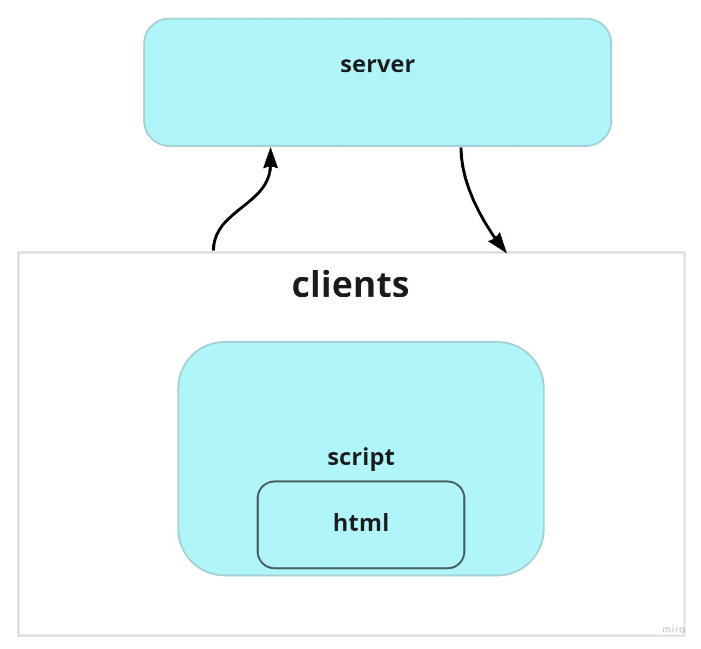

# adv-socket-task13-edit

1-Create html flie that contains a form ==> sends messages from the client(user) and joins to a room .
2-creating socket.io connection with the server .
3-firing events from the client to the  the server Also from the server to the clients.

# UML
